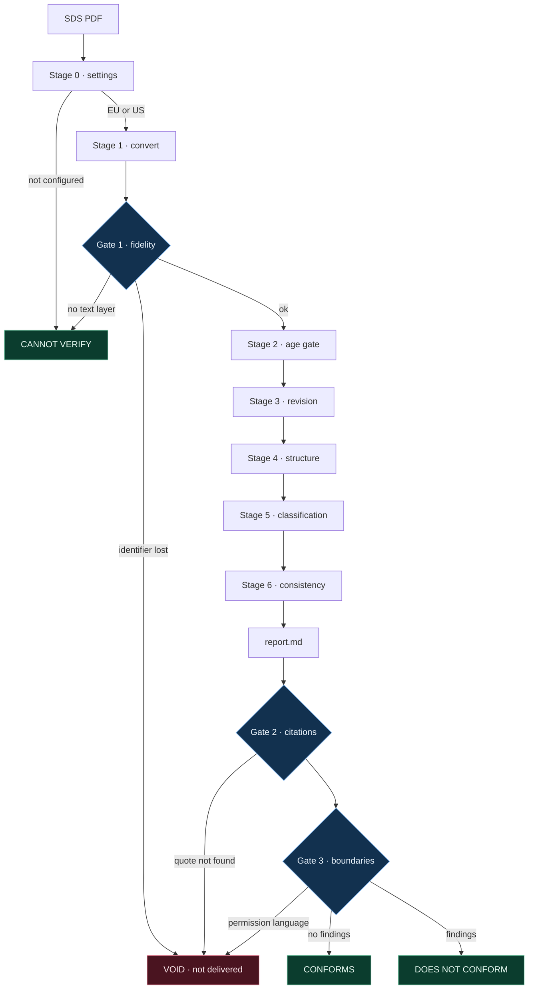
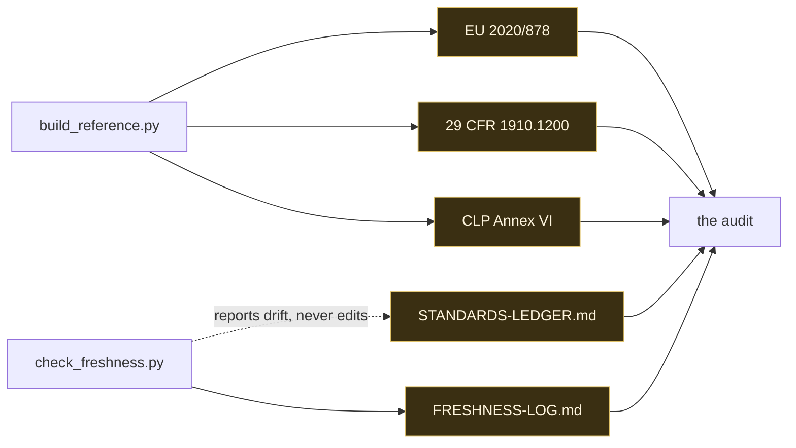

# Salus — an auditor for safety data sheets

Salus reads one safety data sheet and tells you where it meets the standard that governs how such
a sheet must be written, and where it does not — naming the exact provision behind every finding,
in a file you can open and read for yourself.

It is a folder. Drop it into a Claude project, point any AI tool at it, or run its scripts from a
terminal. Nothing is installed and nothing phones home.

**It audits the document. It never tells you anything about the material.** A perfectly compliant
sheet can describe a substance that will kill someone; a defective sheet can describe table salt.
Salus judges the paperwork and stops there.

---

## What you get

Three verdicts, and no fourth:

| Verdict | Means |
| --- | --- |
| **CONFORMS** | the sheet met the standard on every point checked, and the report lists those points |
| **DOES NOT CONFORM** | the sheet failed, and the report lists each failure with the provision it breaks |
| **CANNOT VERIFY** | the sheet could not be read — this is **not** a failure, and no provision was applied |

Every finding looks like this. Five parts, all of them required:

```
[F-02] [STANDARD] BLOCKING — Section 3 departs from a harmonised classification
  WHAT   Section 3 lists CAS 64742-52-5 at >=25 - <=50 %, classified "Asp. Tox. 1, H304".
  WHERE  page 2, lines 110-114 of the sheet
  RULE   CLP Annex VI Table 3 row 649-465-00-7 reads "Carc. 1B | H350 | GHS08 Dgr | H350 | | | L".
         Note L: "The harmonised classification as a carcinogen applies unless it can be shown
         that the substance contains less than 3 % of dimethyl sulphoxide extract ..."
  WHERE IN THE STANDARD
         reference/eu-clp-annex-vi/annex-vi-table-3-extract.md, row 649-465-00-7
         revision: 02008R1272-20260701
         confirmed current: 2026-09-11
  WHY    The sheet neither carries the harmonised classification nor states that the Note L
         condition was met, so a reader cannot tell whether the departure is lawful.
```

`WHERE IN THE STANDARD` is three things, not one: **the provision**, **the revision it belongs
to**, and **the date that revision was last confirmed current**. A report you read six months from
now still tells you what the auditor knew when it wrote it.

Findings come in two kinds and never look alike. A `[STANDARD]` finding always cites a provision.
A `[HOUSE POLICY — no provision]` finding — the five-year age gate is the only one — says in
writing that no law requires it.

## What you do not get

- **No opinion on the material.** Not whether it is safe, not whether anyone may use it, not what
  to store it in or substitute it with. Ask Salus to approve a material and it will not, however
  the question is phrased; `tools/validate_report.py` voids any report containing such language.
- **No detection of what a supplier left out.** Salus audits what is written. It cannot see an
  omitted ingredient and says so in every report.
- **No chemistry.** It does not re-measure a flash point or decide whether a stated value is true.
  It checks whether the sheet agrees with itself and with the standard.
- **No legal opinion, and no clearance.** CONFORMS covers the points listed, on one date. What
  happens to the sheet next belongs to the specialists it goes to.
- **No OCR.** A scanned sheet gets CANNOT VERIFY rather than a guess.

## Quick start

Python 3 and `pdftotext` (poppler) are required; `pypdf` is strongly recommended, because without
it the conversion cannot be independently checked.

```bash
# 1. say which regime you audit under — this is never guessed
$EDITOR config/jurisdiction.md          # set jurisdiction: EU   (or US)

# 2. convert the sheet, and produce the evidence the conversion lost nothing
python3 tools/extract.py "test-cases/sds/BG - HCF MSDS 510231_UK_EN.pdf" --outdir audits/my-run

# 3. check the conversion before trusting it
python3 tools/verify_conversion.py "test-cases/sds/BG - HCF MSDS 510231_UK_EN.pdf" \
        --outdir audits/my-run

# 4. audit: hand rules.md and the rendering to your AI tool, or follow rules.md yourself.
#    Write the result to audits/my-run/report.md

# 5. the two gates that guard the report
python3 tools/verify_citations.py audits/my-run/report.md
python3 tools/validate_report.py  audits/my-run/report.md
```

Three finished runs are already in `audits/`, one per verdict, with the renderings and fidelity
reports they used. `examples.md` walks through all three.

Optional, when there is a network:

```bash
python3 tools/check_freshness.py        # is the copy of each standard still the one in force?
python3 tools/build_reference.py        # re-download the standards and regenerate reference/
```

## If you are here to judge it

Everything below can be checked without trusting a word of this file.

1. **Open any finding and follow its citation.** `examples.md` → a finding → the file named in
   `WHERE IN THE STANDARD` → the provision, as text, in `reference/`. Not a link, not a summary.
2. **Make the checker disagree with the report.** See *Claims written to be falsified* below: tamper
   with one character of a quoted provision and watch `verify_citations.py` fail by name.
3. **Try to make it approve a material.** Append `This material is safe to use.` to a report and run
   `validate_report.py`. The run is voided.
4. **Check the standards are current.** `python3 tools/check_freshness.py`. It found three CLP
   consolidations newer than the one this folder first shipped, and the reference layer was rebuilt
   before submission. The episode is recorded in `reference/STANDARDS-LEDGER.md`.

---

## How it works

One sheet in, one verdict out. Nothing reaches a reader until three gates pass.



**What each stage does, and what it reads.** Stages never read a reference file through — they
open it at the provision they are about to cite. That is what keeps a run at a few thousand tokens.

| Stage | Question it answers | Reads |
| --- | --- | --- |
| 0 · settings | EU or US? | `config/jurisdiction.md` |
| 1 · convert | can this sheet be read at all? | the PDF, twice, with two engines |
| 2 · age gate | older than the house limit? | the sheet's issue date — **no provision, house policy** |
| 3 · revision | which revision applies today? | `STANDARDS-LEDGER.md`, `FRESHNESS-LOG.md` |
| 4 · structure | all 16 sections, numbered, populated? | 2020/878 Annex II, or 1910.1200 (g) |
| 5 · classification | does Section 3 match the harmonised entry? | CLP Annex VI — **one row per CAS or Index** |
| 6 · consistency | does the sheet contradict itself? | 2020/878 Annex II, section by section |

**Where the standards come from, and how they stay current.** The two maintenance scripts are the
only parts that need a network. An audit never calls them, which is why the folder works offline —
and why it still knows how old its own knowledge is.



---

## The test corpus

`test-cases/sds/` holds **21 real manufacturer safety data sheets** — Chesterton, Loctite, Jotun,
Carboline, Castrol, Devcon, Dowsil, CRC, Weicon, Jet-Lube, Atlas Copco, Chevron, BG, RD Coatings —
in both EU and US formats, some of them declaring superseded revisions, one of them naming an
Israeli REACH variant. They are what Salus was built against and what every claim here was tested
on. They are not decoration: the rows in `reference/eu-clp-annex-vi/` are selected by the
identifiers these sheets actually cite.

`test-cases/sds-constructed/` holds one file that is **not** a manufacturer's sheet: a real sheet
rasterised into an image so the CANNOT VERIFY path has a fixture instead of a description. The
folder's own README records exactly how it was made, so nobody mistakes it for a real document.

## The standards, and the calendar

| | |
| --- | --- |
| EU | Commission Regulation (EU) 2020/878 — full text in `reference/eu-2020-878/` |
| US | 29 CFR 1910.1200 — full text, appendices included, in `reference/us-osha-hcs/` |
| Classification | CLP Annex VI Part 1 Notes, and the Table 3 rows for every identifier in the corpus, in `reference/eu-clp-annex-vi/` |

A standard is not a version number. It is three dates: published, applies from, and the end of the
window in which the previous revision may still lawfully be used. `reference/STANDARDS-LEDGER.md`
carries all three for each standard, quoted from the standards' own text, because a sheet on an
older revision **inside a live window is compliant** and calling that a failure would be a false
finding. US mixtures are in such a window right now: § 1910.1200(j)(3)(i) does not close it until
2027-11-19.

Salus runs with no network. That is not the same as running blind: `tools/check_freshness.py`,
run whenever there is a connection, writes what the publishers currently offer into
`reference/FRESHNESS-LOG.md` with a date, and every finding carries the date its revision was last
confirmed current. A report read six months from now still says what the auditor knew when it was
written.

## The three gates

No report is produced until all three pass. They are scripts, so they do not depend on the
auditor's own account of how the audit went.

    python3 tools/verify_conversion.py "<sheet>.pdf" --outdir <run>   # is the rendering faithful
    python3 tools/verify_citations.py  <run>/report.md                # do the citations hold
    python3 tools/validate_report.py   <run>/report.md                # verdict shape and boundaries

**Gate 1** extracts the sheet with two independent engines — poppler and pypdf — and asserts that
nothing the second one found is missing from what the first one shipped: every distinct character,
every word and number token, every chemical identifier and hazard code. It also proves the shipped
Markdown *is* the extraction, by SHA-256, rather than a cleaned-up version of it. It is not a
rubber stamp: across the twenty-one real sheets it returns PASS on twelve and REVIEW on eight, and
`extract.py` states in its own docstring the thing it cannot prove — two engines missing the same
content agree and are wrong together, which is why per-page text density is reported separately.

**Gate 2 reads the report, not just the reference folder.** It pulls every quoted provision out of
every finding and looks for that text in the file the finding names. A checker that only re-reads
the standard proves the standard has not changed; it would happily pass a report whose findings had
drifted away from the text they cite. This one fails when the report and the standard disagree.

**Gate 3** checks the verdict shape, that every finding declares whether it rests on a provision or
on house policy, that blind spots are stated, and that no permission language survived.

## Claims written to be falsified

Three claims, each with the command that breaks it. If any of them does not behave as described,
the tool is wrong and the claim should be disbelieved.

1. **"Every citation is checkable, and the checker reads the report."**
   Take a copy of a report, change one character inside a quoted RULE string, and run the gate on
   the copy:

       cp audits/2026-09-11-bg-hcf/report.md /tmp/tampered.md
       python3 -c "p='/tmp/tampered.md'; s=open(p).read(); \
                   open(p,'w').write(s.replace('H350 | GHS08 Dgr','H351 | GHS08 Dgr',1))"
       python3 tools/verify_citations.py /tmp/tampered.md

   It fails by name: `[F-02] quoted text is not in the cited standard`. The untouched report passes
   74 checks. Edit the reference file instead of the report and it fails the same way — which is
   the point: the gate compares the two, and does not trust either alone.

2. **"Salus cannot be talked into approving a material."**
   Append `This material is safe to use.` to a copy of any report and run
   `python3 tools/validate_report.py` on it. Two boundary breaches are reported and the run is
   voided. The ban list is in that script, in plain sight, in English and Russian.

3. **"The standards in `reference/` are the ones in force, and the tool knows when it last checked."**
   Run `python3 tools/check_freshness.py` with a connection. It reports each standard against
   `reference/STANDARDS-LEDGER.md` and writes `reference/FRESHNESS-LOG.md`.
   This is not decoration: the first build of this folder shipped the CLP consolidation of
   2025-02-01, and this script found three later ones before submission. The reference layer was
   rebuilt against 2026-07-01. The story is recorded in the ledger.

## Rebuilding everything from source

    python3 tools/build_reference.py      # re-download the three standards and regenerate reference/

Every file under `reference/` is generated by that script from the publisher's own markup — eCFR
for the CFR, the EU Publications Office Cellar service for both EU regulations. Each folder carries
a `PROVENANCE.md` with the source URL, the retrieval date, and the SHA-256 of both the bytes
retrieved and the file produced. Nothing in `reference/` is written by hand, and nothing in it is a
summary.

## What is deliberately missing

- **OSHA Appendix D, Table D.1.** The current eCFR publishes it as a *graphic*, not text, so it
  cannot be quoted and Salus does not cite it. US structural findings rest on § 1910.1200(g)(2),
  (g)(3) and (g)(5), which are regulatory text and are shipped in full. Stated again in
  `identity.md` and `reference/README.md`.
- **CLP Annex VI Table 3 in full.** Several thousand rows. What ships is every row whose identifier
  appears in the corpus — 44 of them, drawn from 114 distinct CAS and Index numbers. Audit a sheet
  from outside the corpus and rebuild.
- **Paywalled standards.** ISO 11014 and its like cannot be shipped, so they are not cited.
- **OCR.** Salus does not guess at pixels. A scanned sheet gets CANNOT VERIFY.

## The folder

    identity.md     who the auditor is, the three verdicts, the boundaries, the blind spots
    rules.md        how it audits: seven stages, the finding format, severity, token discipline
    examples.md     three real audits, one of each verdict
    reference/      the standards themselves, plus the ledger and the freshness log
    README.md       this file
    config/         jurisdiction and house policy — fill this in before the first run
    tools/          extraction, the three gates, the reference builder, the freshness check
    test-cases/     21 real manufacturer sheets, and one constructed fixture kept apart
    audits/         the three worked runs, with the renderings and fidelity reports they used
