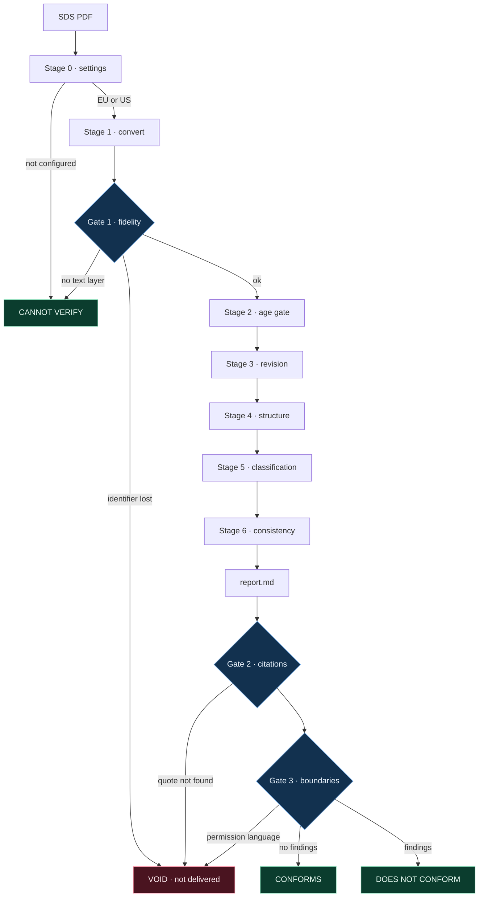
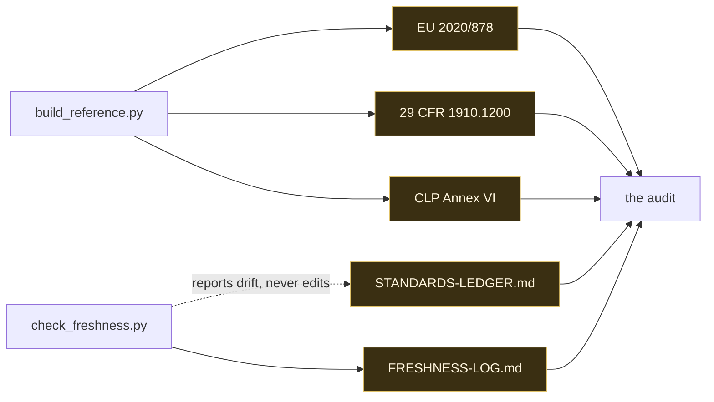

# Salus — an auditor for safety data sheets

Drop this folder into a Claude project, or point any AI tool at it, or run its scripts from a
terminal. It audits one safety data sheet against the standard that governs how such a sheet must
be compiled, and reports what conforms, what does not, and which provision each finding rests on.

It never says whether the material is safe.

---

## How it works

One sheet in, one verdict out. Nothing reaches a reader until three gates pass.

**What each stage does, and what it reads.** Stages never read a reference file through — they
open it at the provision they are about to cite. That is what keeps a run at a few thousand tokens.

| Stage | Question it answers | Reads |
| --- | --- | --- |
| 0 · settings | EU or US? | `config/jurisdiction.md` |
| 1 · convert | can this sheet be read at all? | the PDF, twice, with two engines |
| 2 · age gate | older than the house limit? | the sheet's issue date — **no provision, house policy** |
| 3 · revision | which revision applies today? | `STANDARDS-LEDGER.md`, `FRESHNESS-LOG.md` |
| 4 · structure | all 16 sections, numbered, populated? | 2020/878 Annex II, or 1910.1200 (g) |
| 5 · classification | does Section 3 match the harmonised entry? | CLP Annex VI — **one row per CAS or Index** |
| 6 · consistency | does the sheet contradict itself? | 2020/878 Annex II, section by section |

**Where the standards come from, and how they stay current.** The two maintenance scripts are the
only parts that need a network. An audit never calls them, which is why the folder works offline —
and why it still knows how old its own knowledge is.

---

## Three ways in

**You review safety data sheets for a living.** Start at `config/jurisdiction.md` — set `EU` or
`US` — then read `rules.md` Stage 0 to Stage 6, which is the order Salus works in and is close to
the order you already work in. Then open `examples.md`: three real sheets, three verdicts.

**You are judging this repository.** Open `examples.md`, pick any finding, and follow its
`WHERE IN THE STANDARD` line into `reference/`. The provision is there as text, not as a link and
not as a summary. Then run `python3 tools/verify_citations.py audits/2026-09-11-bg-hcf/report.md`
and see it check every quotation in that report against the shipped standard. Then break one, as
described under **Claims written to be falsified** below.

**You are an AI tool that has just been handed this folder.** Read `identity.md` first — it is
short and it contains the boundaries you may not cross. Then `rules.md`. Do not read `reference/`
end to end: it is 450 KB of regulation, and `rules.md` tells you how to open it by identifier.

---

## What to feed it

One safety data sheet at a time, as a PDF. The twenty-one real manufacturer sheets in
`test-cases/sds/` are the corpus this was built against — Chesterton, Loctite, Jotun, Carboline,
Castrol, Devcon, Dowsil, CRC, Weicon, Jet-Lube, Atlas Copco, Chevron, BG, RD Coatings — in both EU
and US formats.

    python3 tools/extract.py "test-cases/sds/<sheet>.pdf" --outdir audits/<run>

That writes two files: `<sheet>.salus.md`, the rendering the auditor reads, and
`<sheet>.fidelity.json`, the evidence that the rendering lost nothing. Then audit the rendering
against `rules.md` and run the three gates.

## The three verdicts

**CONFORMS** · **DOES NOT CONFORM** · **CANNOT VERIFY**. There is no fourth, no score, and no
percentage. CANNOT VERIFY means the sheet could not be read — it is not a failure. The distinction
is the difference between "this document breaks the rule" and "I could not establish what I was
looking at", and collapsing the two is how an auditor starts inventing.

## What Salus will not do

It does not decide whether a material is dangerous, does not advise on handling, storage or
substitution, and cannot be argued into a different verdict because a deadline is tight or a
manager already approved something. `identity.md` states the boundaries; `tools/validate_report.py`
enforces them over the finished text, in English and Russian, and voids the run if permission
language appears. A user's instruction does not outrank the standard — that is the entire reason
an auditor exists.

It also audits **what is written, never what is absent.** A supplier lists what it is obliged to
list. Salus cannot see an omitted ingredient and says so in every report.

## The standards, and the calendar

| | |
| --- | --- |
| EU | Commission Regulation (EU) 2020/878 — full text in `reference/eu-2020-878/` |
| US | 29 CFR 1910.1200 — full text, appendices included, in `reference/us-osha-hcs/` |
| Classification | CLP Annex VI Part 1 Notes, and the Table 3 rows for every identifier in the corpus, in `reference/eu-clp-annex-vi/` |

A standard is not a version number. It is three dates: published, applies from, and the end of the
window in which the previous revision may still lawfully be used. `reference/STANDARDS-LEDGER.md`
carries all three for each standard, quoted from the standards' own text, because a sheet on an
older revision **inside a live window is compliant** and calling that a failure would be a false
finding. US mixtures are in such a window right now: § 1910.1200(j)(3)(i) does not close it until
2027-11-19.

Salus runs with no network. That is not the same as running blind: `tools/check_freshness.py`,
run whenever there is a connection, writes what the publishers currently offer into
`reference/FRESHNESS-LOG.md` with a date, and every finding carries the date its revision was last
confirmed current. A report read six months from now still says what the auditor knew when it was
written.

## The three gates

No report is produced until all three pass. They are scripts, so they do not depend on the
auditor's own account of how the audit went.

    python3 tools/verify_conversion.py "<sheet>.pdf" --outdir <run>   # is the rendering faithful
    python3 tools/verify_citations.py  <run>/report.md                # do the citations hold
    python3 tools/validate_report.py   <run>/report.md                # verdict shape and boundaries

**Gate 1** extracts the sheet with two independent engines — poppler and pypdf — and asserts that
nothing the second one found is missing from what the first one shipped: every distinct character,
every word and number token, every chemical identifier and hazard code. It also proves the shipped
Markdown *is* the extraction, by SHA-256, rather than a cleaned-up version of it. It is not a
rubber stamp: across the twenty-one real sheets it returns PASS on twelve and REVIEW on eight, and
`extract.py` states in its own docstring the thing it cannot prove — two engines missing the same
content agree and are wrong together, which is why per-page text density is reported separately.

**Gate 2 reads the report, not just the reference folder.** It pulls every quoted provision out of
every finding and looks for that text in the file the finding names. A checker that only re-reads
the standard proves the standard has not changed; it would happily pass a report whose findings had
drifted away from the text they cite. This one fails when the report and the standard disagree.

**Gate 3** checks the verdict shape, that every finding declares whether it rests on a provision or
on house policy, that blind spots are stated, and that no permission language survived.

## Claims written to be falsified

Three claims, each with the command that breaks it. If any of them does not behave as described,
the tool is wrong and the claim should be disbelieved.

1. **"Every citation is checkable, and the checker reads the report."**
   Take a copy of a report, change one character inside a quoted RULE string, and run the gate on
   the copy:

       cp audits/2026-09-11-bg-hcf/report.md /tmp/tampered.md
       python3 -c "p='/tmp/tampered.md'; s=open(p).read(); \
                   open(p,'w').write(s.replace('H350 | GHS08 Dgr','H351 | GHS08 Dgr',1))"
       python3 tools/verify_citations.py /tmp/tampered.md

   It fails by name: `[F-02] quoted text is not in the cited standard`. The untouched report passes
   74 checks. Edit the reference file instead of the report and it fails the same way — which is
   the point: the gate compares the two, and does not trust either alone.

2. **"Salus cannot be talked into approving a material."**
   Append `This material is safe to use.` to a copy of any report and run
   `python3 tools/validate_report.py` on it. Two boundary breaches are reported and the run is
   voided. The ban list is in that script, in plain sight, in English and Russian.

3. **"The standards in `reference/` are the ones in force, and the tool knows when it last checked."**
   Run `python3 tools/check_freshness.py` with a connection. It reports each standard against
   `reference/STANDARDS-LEDGER.md` and writes `reference/FRESHNESS-LOG.md`.
   This is not decoration: the first build of this folder shipped the CLP consolidation of
   2025-02-01, and this script found three later ones before submission. The reference layer was
   rebuilt against 2026-07-01. The story is recorded in the ledger.

## Rebuilding everything from source

    python3 tools/build_reference.py      # re-download the three standards and regenerate reference/

Every file under `reference/` is generated by that script from the publisher's own markup — eCFR
for the CFR, the EU Publications Office Cellar service for both EU regulations. Each folder carries
a `PROVENANCE.md` with the source URL, the retrieval date, and the SHA-256 of both the bytes
retrieved and the file produced. Nothing in `reference/` is written by hand, and nothing in it is a
summary.

## What is deliberately missing

- **OSHA Appendix D, Table D.1.** The current eCFR publishes it as a *graphic*, not text, so it
  cannot be quoted and Salus does not cite it. US structural findings rest on § 1910.1200(g)(2),
  (g)(3) and (g)(5), which are regulatory text and are shipped in full. Stated again in
  `identity.md` and `reference/README.md`.
- **CLP Annex VI Table 3 in full.** Several thousand rows. What ships is every row whose identifier
  appears in the corpus — 44 of them, drawn from 114 distinct CAS and Index numbers. Audit a sheet
  from outside the corpus and rebuild.
- **Paywalled standards.** ISO 11014 and its like cannot be shipped, so they are not cited.
- **OCR.** Salus does not guess at pixels. A scanned sheet gets CANNOT VERIFY.

## The folder

    identity.md     who the auditor is, the three verdicts, the boundaries, the blind spots
    rules.md        how it audits: seven stages, the finding format, severity, token discipline
    examples.md     three real audits, one of each verdict
    reference/      the standards themselves, plus the ledger and the freshness log
    README.md       this file
    config/         jurisdiction and house policy — fill this in before the first run
    tools/          extraction, the three gates, the reference builder, the freshness check
    test-cases/     21 real manufacturer sheets, and one constructed fixture kept apart
    audits/         the three worked runs, with the renderings and fidelity reports they used
