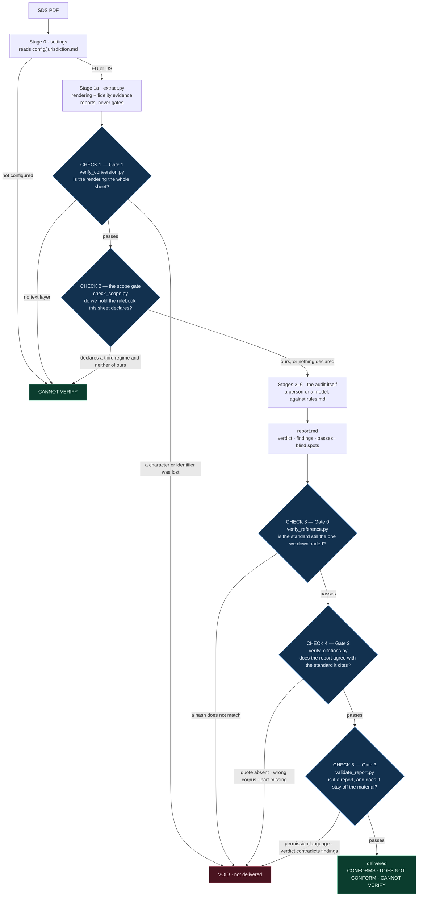
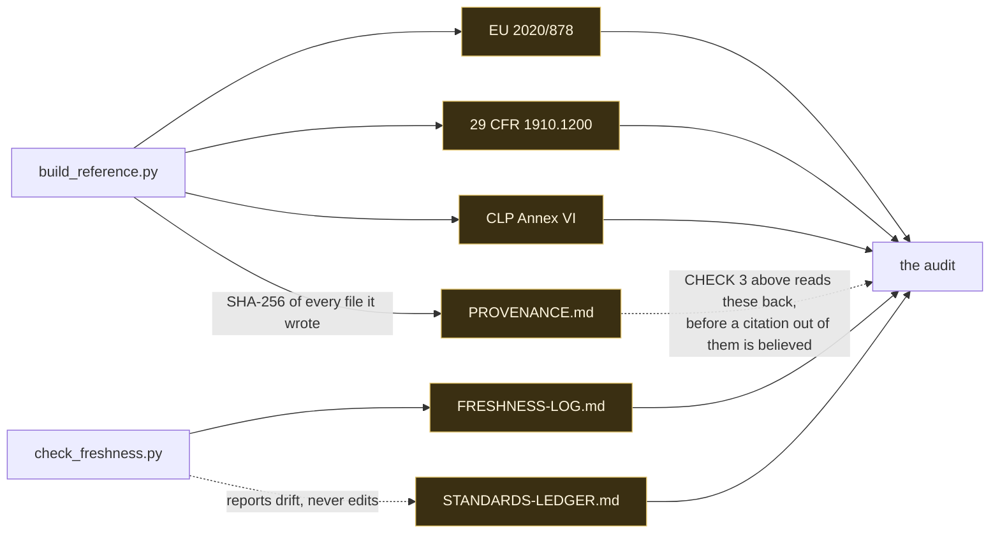

# Salus — an auditor for safety data sheets

Salus reads one safety data sheet and tells you where it meets the standard that governs how such
a sheet must be written, and where it does not. Every finding names the provision it rests on, in
a file you can open and read for yourself.

It is a folder. Drop it into a Claude project, point any AI tool at it, or run its scripts from a
terminal. Nothing is installed and nothing phones home. Those three surfaces are not the same
auditor, though: the gates that guard a report are scripts, and a Claude project has no shell to
run them in. *Where it runs, and what each surface costs you*, below, sets out the difference.

**It audits the document. It never tells you anything about the material.** A perfectly compliant
sheet can describe a substance that will kill someone; a defective sheet can describe table salt.
Salus judges the paperwork and stops there.

---

## What you get

Three verdicts, and no fourth:

| Verdict | Means |
| --- | --- |
| **CONFORMS** | the sheet met the standard on every point checked, and the report lists those points |
| **DOES NOT CONFORM** | the sheet failed, and the report lists each failure with the provision it breaks |
| **CANNOT VERIFY** | the sheet could not be read, **or** it was compiled to a standard this folder does not ship — this is **not** a failure, and no provision was applied |

Every finding looks like this. Five parts, all of them required:

```md
[F-02] [STANDARD] BLOCKING — Section 3 departs from a harmonised classification
  WHAT   Section 3 lists CAS 64742-52-5 at >=25 - <=50 %, classified "Asp. Tox. 1, H304".
  WHERE  page 2, lines 110-114 of the sheet
  RULE   CLP Annex VI Table 3 row 649-465-00-7 reads "Carc. 1B | H350 | GHS08 Dgr | H350 | | | L".
         Note L: "The harmonised classification as a carcinogen applies unless it can be shown
         that the substance contains less than 3 % of dimethyl sulphoxide extract ..."
  WHERE IN THE STANDARD
         reference/eu-clp-annex-vi/annex-vi-table-3-extract.md, row 649-465-00-7
         revision: 02008R1272-20260701
         confirmed current: 2026-09-11
  WHY    The sheet neither carries the harmonised classification nor states that the Note L
         condition was met, so a reader cannot tell whether the departure is lawful.
```

`WHERE IN THE STANDARD` carries three things: the provision, the revision it belongs to, and the
date that revision was last confirmed current. A report you read six months from now still tells
you what the auditor knew when it wrote it.

Findings come in two kinds and never look alike. A `[STANDARD]` finding always cites a provision.
A `[HOUSE POLICY — no provision]` finding (the five-year age gate is the only one) says in writing
that no law requires it.

## What you do not get

- **No opinion on the material.** Not whether it is safe, not whether anyone may use it, not what
  to store it in or substitute it with. Ask Salus to approve a material and it will not, however
  the question is phrased; `tools/validate_report.py` voids any report containing such language.
- **No detection of what a supplier left out.** Salus audits what is written. It cannot see an
  omitted ingredient and says so in every report.
- **No chemistry.** It does not re-measure a flash point or decide whether a stated value is true.
  It checks whether the sheet agrees with itself and with the standard.
- **No legal opinion, and no clearance.** CONFORMS covers the points listed, on one date. What
  happens to the sheet next belongs to the specialists it goes to.
- **No third-regime audits.** Salus holds EU 2020/878 and US 29 CFR 1910.1200 and nothing else. A
  sheet compiled to GB/T 16483, JIS Z 7253, GOST 30333 or SOR/2015-17 stops at the scope gate with
  CANNOT VERIFY. It is not audited against the configured standard and scored against obligations
  it was never written to. See *An incident, and the gate it produced* below.
- **No OCR.** A scanned sheet gets CANNOT VERIFY rather than a guess.

## Where it runs, and what each surface costs you

The audit is a reading, and a reading works anywhere. The machinery that *checks* the reading is a
handful of Python scripts, and those need a shell. What their absence costs, line by line:

| | Terminal, or an agent with a shell | Claude project, or any AI tool without one |
| --- | --- | --- |
| The standards in `reference/`, opened at the provision | yes | yes |
| The seven stages, the finding format, the severity ladder | yes | yes |
| Line-anchored rendering and its fidelity evidence (`extract.py`) | yes | **no** — you supply the text, and nothing proves what it lost |
| **Gate 1** — conversion fidelity, two independent engines | yes | **no** |
| **The scope gate** — is the sheet's own standard one this folder holds | yes | **no** — `rules.md` Stage 1b still says to stop, but nothing enforces it, and this is the check whose absence filed a retracted run |
| **Gate 0** — the shipped standards rehashed against the provenance record | yes | **no** — the corpus you read may have been edited, and nothing says so |
| **Gate 2** — every citation checked against the file it names | yes | **no** |
| **Gate 3** — verdict shape, and the ban on saying anything about the material | yes | **no** — the boundary is prose, and prose is not enforcement |

In a Claude project you get the auditor's judgement without the machinery built to distrust it.
`tools/CONTEXT.md` argues that catching a breach after the fact is the second-best outcome; on this
surface there is no after the fact at all.

**What to do about it.** A report written in a Claude project is just a text file. Bring it to a
terminal, run Gates 2 and 3 over it, and it is guarded exactly as if it had been written there:

    python3 tools/verify_citations.py <report.md>
    python3 tools/validate_report.py  <report.md>

The scope gate recovers in the other direction. It reads the sheet rather than the report, so it
can be run on any rendering, before or after the fact, and where no shell is available `rules.md`
Stage 1b is the instruction to perform it by eye. Read the sheet's first page and Section 15 for a
declaration of the standard it was compiled to, and if that standard is not in `reference/`, stop.

Gate 1 is the one that cannot be recovered afterwards, because it is a claim about a conversion
that already happened somewhere else. Where no shell ran `extract.py`, the report should say so:
the rendering was not verified, and that is a fact about the audit worth writing down.

## Quick start

**Requirements.** Python 3, `pdftotext` from poppler, and `pypdf`. All three are required: Gate 1's
whole claim is that two *independent* engines agree, so without pypdf there is no check, only an
assertion. Add `cryptography` as well, because at least one sheet in the shipped corpus is
AES-encrypted and pypdf cannot open it without that package.

    pip install pypdf cryptography

```bash
# 1. say which regime you audit under — this is never guessed
$EDITOR config/jurisdiction.md          # set jurisdiction: EU   (or US)

# 2. convert the sheet, and produce the evidence the conversion lost nothing
python3 tools/extract.py "test-cases/sds/BG - HCF MSDS 510231_UK_EN.pdf" --outdir audits/my-run

# 3. check the conversion before trusting it
python3 tools/verify_conversion.py "test-cases/sds/BG - HCF MSDS 510231_UK_EN.pdf" \
        --outdir audits/my-run

# 3b. is there a rulebook here for this sheet at all? exit 2 means stop, do not audit
python3 tools/check_scope.py "audits/my-run/BG - HCF MSDS 510231_UK_EN.salus.md"

# 4. audit: hand rules.md and the rendering to your AI tool, or follow rules.md yourself.
#    Write the result to audits/my-run/report.md

# 5. the checks that guard the report — Gate 2 runs Gate 0 (the corpus hash
#    check) itself, so these two commands are three checks
python3 tools/verify_citations.py audits/my-run/report.md
python3 tools/validate_report.py  audits/my-run/report.md
```

`extract.py` reports and does not gate: it exits 0 on every verdict it can reach, because writing
the rendering and the evidence is its whole job. `verify_conversion.py` is where a verdict becomes an
exit code. Chain them in that order and the shell stops where `rules.md` says to stop, and nowhere
else.

Eight finished runs are already in `audits/`, covering both jurisdictions and all three verdicts,
with the renderings and fidelity reports they used. `examples.md` walks through five of them in
detail.

Optional, when there is a network:

```bash
python3 tools/check_freshness.py        # is the copy of each standard still the one in force?
python3 tools/build_reference.py        # re-download the standards and regenerate reference/
```

## If you are here to judge it

Everything below can be checked without trusting a word of this file. Items 2 to 4 run scripts, so
they need a terminal; if you are reading this inside a Claude project, see *Where it runs* above.

1. **Open any finding and follow its citation.** `examples.md` → a finding → the file named in
   `WHERE IN THE STANDARD` → the provision, as text, in `reference/`. The chain ends at the
   regulation's own wording, not at a link to it or a summary of it. Five of the eight filed runs
   are walked there: three EU, one US, and one that could not be read at all.
2. **Make the checker disagree with the report.** See *Claims written to be falsified* below: tamper
   with one character of a quoted provision and watch `verify_citations.py` fail by name.
3. **Try to make it approve a material.** Append `This material is safe to use.` to a report and run
   `validate_report.py`. The run is voided.
4. **Check the standards are current.** `python3 tools/check_freshness.py`. It found three CLP
   consolidations newer than the one this folder first shipped, and the reference layer was rebuilt
   before submission. The episode is recorded in `reference/STANDARDS-LEDGER.md`.

---

## How it works

One sheet in, one verdict out, and **five checks in between**. Two of them can end the run before
the audit starts — an unreadable sheet, and a sheet written to a standard that is not here — and
three stand between the finished report and its reader. Each is a separate script with its own exit
code, so none of them depends on the auditor's account of how the audit went. They are numbered on
the diagram in the order a run meets them.



Checks 1 and 2 guard the run: they decide whether there is anything to audit and whether this folder
holds the rulebook for it. Checks 3, 4 and 5 guard the report, and they run in that order for a
reason — Gate 2 calls Gate 0 before it reads a single citation, because *the quoted provision appears
in the standard* is worth exactly what the standard being unmodified is worth. A sixth script,
`test_docs_example.py`, checks this repository rather than a sheet: it puts the worked example out of
`rules.md` through Gates 2 and 3, so the file that teaches the citation format cannot drift into
teaching one the gates reject.

**What each stage does, and what it reads.** No stage reads a reference file through; each opens it
at the provision it is about to cite. That is what keeps a run at a few thousand tokens.

| Stage | Question it answers | Reads |
| --- | --- | --- |
| 0 · settings | EU or US? | `config/jurisdiction.md` |
| 1a · convert | can this sheet be read at all? | the PDF, twice, with two engines |
| 1b · scope | is it written to a standard this folder holds? | the sheet's own declaration, and `config/jurisdiction.md` |
| 2 · age gate | older than the house limit? | the sheet's issue date — **no provision, house policy** |
| 3 · revision | which revision applies today? | `STANDARDS-LEDGER.md`, `FRESHNESS-LOG.md` |
| 4 · structure | all 16 sections, numbered, populated? | 2020/878 Annex II, or 1910.1200 (g) |
| 5 · classification | does Section 3 match the harmonised entry? | CLP Annex VI — **one row per CAS or Index** |
| 6 · consistency | does the sheet contradict itself? | 2020/878 Annex II, section by section |

**Where the standards come from, and how they stay current.** The two maintenance scripts are the
only parts that need a network. An audit never calls them. That is why the folder works offline,
and why it still knows how old its own knowledge is. Nothing under `reference/` is written by hand:
`build_reference.py` generates every file from a citable source and records the SHA-256 of what it
wrote in a `PROVENANCE.md` beside it. Those hashes are what CHECK 3 above reads — the corpus is not
trusted because this file says so, it is rehashed before a citation out of it is believed.



---

## The test corpus

`test-cases/sds/` holds **22 real manufacturer safety data sheets** — Chesterton, Loctite, Jotun,
Carboline, Castrol, Devcon, Dowsil, CRC, Weicon, Jet-Lube, Atlas Copco, Chevron, BG, Nye Lubricants,
RD Coatings — in both EU and US formats, some of them declaring superseded revisions, one of them
naming an Israeli REACH variant. They are what Salus was built against and what every claim here
was tested on. The rows in `reference/eu-clp-annex-vi/` are selected by the identifiers these
sheets actually cite.

`test-cases/sds-constructed/` holds two files that no supplier issued. One is a real sheet
rasterised into an image, so the CANNOT VERIFY path has a fixture and not just a description. The
other is a real, current sheet cut down to its first four pages of twenty, which tests the line
between *unreadable* and *incomplete*: those are different verdicts and only one of them is a
failure. The folder's own README records exactly how each was made, so neither is mistaken for a
supplier's document.

## The standards, and the calendar

| | |
| --- | --- |
| EU | Commission Regulation (EU) 2020/878 — full text in `reference/eu-2020-878/` |
| US | 29 CFR 1910.1200 — full text, appendices included, in `reference/us-osha-hcs/` |
| Classification | CLP Annex VI Part 1 Notes, and the Table 3 rows for every identifier in the corpus, in `reference/eu-clp-annex-vi/` |

A standard is three dates rather than a version number: published, applies from, and the end of the
window in which the previous revision may still lawfully be used. `reference/STANDARDS-LEDGER.md`
carries all three for each standard, quoted from the standards' own text, because a sheet on an
older revision **inside a live window is compliant** and calling that a failure would be a false
finding. US mixtures are in such a window right now: § 1910.1200(j)(3)(i) does not close it until
2027-11-19.

Salus runs with no network, which is not the same as running blind. `tools/check_freshness.py`,
run whenever there is a connection, writes what the publishers currently offer into
`reference/FRESHNESS-LOG.md` with a date, and every finding carries the date its revision was last
confirmed current.

## The scope gate

    python3 tools/check_scope.py <run>/<sheet>.salus.md      # exit 2 = out of scope, stop

It runs once, after the conversion gate and before the audit, and it answers one question: does
this folder hold the rulebook this sheet was written to? It reads the sheet's own declaration,
which suppliers put on the first line, in the header, or in Section 15, and compares it with what
is in `reference/`.

| What the sheet declares | What happens |
| --- | --- |
| the configured standard | the audit runs |
| the *other* standard shipped here (a US sheet under `jurisdiction: EU`, or the reverse) | the audit runs, and Stage 3 reports the mismatch as a finding — both rulebooks are here, so the comparison rests on text |
| a third regime **and** the configured standard — a sheet written for two markets | the audit runs against the configured one; the third declaration is not a finding |
| a third regime and **neither** standard shipped here | **stop.** CANNOT VERIFY, out of scope, no findings |
| nothing at all | the audit runs; Stage 3 infers the revision from the issue date and says it inferred it |

It fires on declarations only, never on a country name, an address, a language, an emergency
number or an inventory list. A word on its own is not a declaration either. `REACH` counts only
where the sheet writes it as one: prepared, compiled or conforming to it, or Annex II named
beside it. *"Keep out of reach of children"* is GHS precautionary statement P102, printed on
sheets of every regime including the ones this folder does not hold. Two sheets in the corpus
declare REACH, 29 CFR 1910.1200 and Canada's WHMIS on a single line, and both are audited
normally: a sheet naming a rulebook this folder holds is never stopped, whatever else it names.
Across all twenty-four shipped sheets it stops exactly one.

*Until this was fixed, one sentence disarmed it.* The pattern matched the bare word, so P102
counted as a declaration of the EU standard, and appending that precautionary line to the Chinese
sheet turned the stop into an audit — reopening the incident below.

## The gates, one at a time

Checks 1 to 5 from the diagram above, in the order a run meets them. No report is produced until
every one of them passes.

    python3 tools/verify_conversion.py "<sheet>.pdf" --outdir <run>   # 1 · is the rendering faithful
    python3 tools/check_scope.py       <run>/<sheet>.salus.md         # 2 · is there a rulebook for it
    python3 tools/verify_reference.py                                 # 3 · is the corpus unmodified
    python3 tools/verify_citations.py  <run>/report.md                # 4 · do the citations hold
    python3 tools/validate_report.py   <run>/report.md                # 5 · verdict shape and boundaries

Run them from any directory. Gate 2 resolves the `reference/...` path a finding names against the
Salus folder it ships in rather than against yours, so the same report returns the same counts
from a fresh clone's root and from your home directory.

**Gate 1** extracts the sheet with two independent engines, poppler and pypdf, and asserts that
nothing the second one found is missing from what the first one shipped: every distinct character,
every word and number token, every chemical identifier and hazard code. It runs the same comparison
`extract.py` wrote into the fidelity report — the same function, not a second implementation of it —
against different inputs: the PDF and the rendering on disk, never the JSON. It also proves the
shipped Markdown *is* the extraction, by SHA-256, rather than a cleaned-up version of it. It is no
rubber stamp: across the twenty-two real sheets it returns PASS on twelve, REVIEW on nine, and
UNCONFIRMED on one, a sheet encrypted with AES that the second engine cannot open without the
`cryptography` package, so its completeness is simply not checked and the report says so. On the
constructed scanned sheet it returns NO TEXT LAYER and exits 1, with or without `--strict`. It used
to call that a pass: a gate that compares two empty extractions, finds them equal and reports
success has proved nothing. `extract.py` states in its own docstring the thing it cannot prove, that
two engines missing the same content agree and are wrong together, which is why per-page text
density is reported separately.

**Gate 2 reads the report, not just the reference folder.** It pulls every quoted provision out of
every finding and looks for that text in the file the finding names. A checker that only re-reads
the standard proves the standard has not changed; it would happily pass a report whose findings had
drifted away from the text they cite. This one fails when the report and the standard disagree.

**Gate 2 stands on `verify_reference.py`, and calls it first.** "The quoted provision appears in the
standard" is worth no more than the standard being the one that was downloaded: a date edited into
the regulation would be *confirmed* by the gate whose job is to confirm provisions. So every
generated file is rehashed against the SHA-256 that `build_reference.py` wrote into its
`reference/*/PROVENANCE.md` before a single citation is checked. That is 4 files and 451 KB, about
5 ms against the gate's own 130. A corpus that does not match its own provenance stops the gate
with that diagnosis rather than blaming the report, and there is no flag to skip it. Run
`python3 tools/verify_reference.py` on its own to ask the question about the folder rather than
about a report: it takes no arguments, and claim 7 below breaks it.

Gate 2 also enforces the **corpus rule**: an EU run may cite Annex II and CLP Annex VI, a US run
may cite 29 CFR 1910.1200 and nothing else, because OSHA publishes no harmonised classification
list and none is shipped for it. A finding standing on Annex VI in a US report stands on a
regulation that does not govern the sheet. The regime comes from the report's own header row rather
than from `config/jurisdiction.md`, because a filed report keeps the regime it was made under, and
`audits/` holds both regimes, checked together, against one setting that can say only one thing. A
disagreement with the setting is printed as a note; a report that names no regime at all fails.

There is a fourth check, smaller and aimed at this repository rather than at a sheet.
`tools/test_docs_example.py` lifts the worked finding out of `rules.md` and runs the two report
gates over it, so the file that teaches the citation format cannot drift into teaching one the
gates reject.

**Gate 3** checks the verdict against the report's own contents — a CONFORMS or a CANNOT VERIFY
report that lists findings is refused, because a finding of either class produces DOES NOT CONFORM —
that every finding tag declares whether it rests on a provision or on house policy, that the header
names a regime and applies that regime's standard, that the blind spots are declared under their
heading rather than merely announced by it, and that no permission language survived outside
quotation marks. On a US run it also requires the report to
record Section 3 as *not assessed for classification correctness*, the sentence that keeps a US
report from reading as though the classification had been checked and held.

## An incident, and the gate it produced

On 2026-09-11 a sheet was audited here that should never have been audited at all, and the folder
had nothing in it that could say so.

`SDS_CHINA_English_TS+2024.pdf` is a real supplier sheet from Nye Lubricants, a FUCHS Group company,
for the Chinese market. Its first line reads *"Prepared in accordance with GB/T 16483 and GB/T
17519"*, and its Section 15 lists the Chinese laws it conforms to. It declares neither EU 2020/878
nor US 29 CFR 1910.1200. The run was made under `jurisdiction: EU`, so it was compared with Annex II
from beginning to end, and it was filed as **DOES NOT CONFORM with eleven findings**.

Every one of those findings was accurate as a reading of the text. All three gates that existed
that morning passed on it. It was still wrong: the eleven findings are not eleven defects. They are
**one observation, that the wrong ruler was used, restated once per provision**. A reader cannot
tell that list apart from a list of real defects, and the document is not defective. It is a
competent sheet written to a standard this folder does not hold.

Nothing in the folder caught it. `config/jurisdiction.md` explicitly *instructed* the behaviour: it
said a sheet compiled for another regime is audited against the configured one and the mismatch
reported as a finding. That rule was written with the EU↔US crossing in mind, where both rulebooks
ship and the comparison means something. Extended to a third regime it produces a confident
verdict with nothing underneath it.

**What changed, the same day:**

| | |
| --- | --- |
| `tools/check_scope.py` | new. The scope gate, above. Exits 2 on this sheet, naming both declarations and the line each sits on |
| `rules.md` Stage 1b | the stop condition, in the contract the auditor actually follows |
| `identity.md` | the two standards are stated as *scope*, and CANNOT VERIFY now covers "no rulebook here for this", not only "cannot read this" |
| `config/jurisdiction.md` | the rule that caused it is corrected, and the difference between the EU↔US crossing and a third regime is spelled out |
| `audits/2026-09-11-nye-ts2024-china/` | **retracted**, kept in place, with a notice at its head saying what it was and what it should have been |
| `audits/2026-09-11-nye-ts2024-china-scope-stop/` | the run as it should have gone: the stop, no findings, and an explicit statement that Salus makes no judgement about the sheet in its own regime |

The bad run is kept rather than deleted. An auditor that removes the evidence of its own bad run
has no standing to ask anyone else to keep theirs.

## Claims written to be falsified

Eight claims, each with the command that breaks it. If any of them does not behave as described,
the tool is wrong and the claim should be disbelieved. Six of them are stated in two parts: what
the gate does now, and what it did before an architecture review broke it. A tool that reports
only the defects it never had is not being audited.

1. **"Every citation is checkable, and the checker reads the report."**
   Take a copy of a report, change one character inside a quoted RULE string, and run the gate on
   the copy:

       cp audits/2026-09-11-bg-hcf/report.md /tmp/tampered.md
       python3 -c "p='/tmp/tampered.md'; s=open(p).read(); \
                   open(p,'w').write(s.replace('H350 | GHS08 Dgr','H351 | GHS08 Dgr',1))"
       python3 tools/verify_citations.py /tmp/tampered.md

   It fails by name: `[F-02] quoted text is not in the cited standard`. The untouched report passes
   74 checks. Edit the reference file instead of the report and the gate fails too, with the other
   diagnosis: claim 7 below, where it names the standard as the thing that moved. The gate compares
   the two and trusts neither alone.

2. **"Salus cannot be talked into approving a material — and the ban does not depend on where the
   words sit."**
   Append `This material is safe to use.` to a copy of any report and run
   `python3 tools/validate_report.py` on it. Two boundary breaches are reported and the run is
   voided. Then run the harder versions. Put `This material is safe to use and workers may use
   it.` *inside* a finding, on an indented `WHY` line, where an auditor's own prose actually
   lives: three breaches. Break it across the line wrap this format mandates, so no single line
   carries the whole phrase: still refused. Write it into the summary table at the top of the
   report: refused there too. Only text inside quotation marks is exempt, because a finding has to
   be able to quote a sheet whose Section 7 says "safe to use" without being accused of having
   said it.

   *This is the gate's third implementation.* The first exempted any line indented four or more
   spaces, reasoning that indented lines are quotations, and `rules.md` mandates exactly that
   indentation for every `WHAT`, `WHERE`, `RULE` and `WHY`. Roughly three quarters of every report
   went unscanned, and the appended form above was the one path that still worked. The second
   replaced that with a list of exempt contexts: a blockquote, a table row, any line carrying the
   word *quote*, a Salus disclaimer. Each was a way of saying the banned thing and being told the
   report may be delivered — `| Conclusion | the material is safe to use |` was exempt for being a
   table row, in the summary table, which is the first thing a reader sees. There is no list now.
   Quotation is marked by quotation marks and by nothing else; the marks have to pair, so a report
   carrying an odd number of them is refused before it is scanned at all; and the scan reads the
   whole report rather than one line at a time, because this format wraps a sentence across lines
   and a breach does not stop being one at the line break. The ban list is in that script, in
   plain sight, in English and Russian.

3. **"The standards in `reference/` are the ones in force, and the tool knows when it last checked."**
   Run `python3 tools/check_freshness.py` with a connection. It reports each standard against
   `reference/STANDARDS-LEDGER.md` and writes `reference/FRESHNESS-LOG.md`.
   The first build of this folder shipped the CLP consolidation of 2025-02-01, and this script
   found three later ones before submission. The reference layer was
   rebuilt against 2026-07-01. The story is recorded in the ledger.

4. **"A finding cites the standard, not this repository's own prose."**
   `reference/` also carries the folder's own routing, its provenance hashes and its calendar.
   None of those is a provision. Write a finding that quotes `reference/CONTEXT.md` and names it
   under `WHERE IN THE STANDARD`, and Gate 2 refuses it by name: *cites … as a provision. That file
   is this folder's own bookkeeping, not the standard.*

   *Until this was fixed it passed with zero failures.* The gate walked every `.md` under
   `reference/`, so what it actually proved was that a quoted string appeared in some markdown this
   folder ships, which is a weaker claim than the one it was making.

5. **"Five parts are required of a finding, and five are enforced."**
   Delete every `WHERE` line from a copy of a report, the part that locates the defect in the
   sheet, and Gate 2 fails once per finding.

   Blank the body of every `WHY` and leave the labels standing: it fails once per finding. Strip
   the `[STANDARD]` marker off one heading and it fails that heading by name.

   *Until this was fixed, none of the three held.* `^\s*WHERE\b` also matched the heading
   `WHERE IN THE STANDARD`, because the word boundary sits in the space before *IN*, so a finding
   carrying only the latter satisfied both and five required parts were enforced as four. An
   emptied part returned the empty string rather than nothing at all, so the gate asked whether
   the five words were present rather than the five parts. An unmarked heading fared worse: the
   block was not failed, it was not seen, and the report left the gate carrying the counts of a
   shorter report it was not.

6. **"A sheet written to a standard that is not here stops the run, and a report that only lists
   failures does not pass."**
   Two commands, one for each half:

       python3 tools/check_scope.py \
           audits/2026-09-11-nye-ts2024-china-scope-stop/SDS_CHINA_English_TS+2024.salus.md
       echo "exit $?"        # 2 — out of scope, China, GB/T 16483 and GB/T 17519, line 2

   Run it over the rendering of every other run in `audits/` and each exits 0. The two China
   folders hold the same sheet, and both stop. Then take a copy of any report, delete its `[P-n]`
   blocks, and run Gate 3: it fails, whatever the verdict. Replace them with a bare
   `- [P-01] looked fine` bullet and it fails again, because a pass is written the way a finding is
   written or it does not count.

   *Until both were fixed, neither held.* A GB/T sheet was audited against Annex II and filed with
   eleven findings; see *An incident, and the gate it produced*. And passes were demanded only of a
   CONFORMS report, so a DOES NOT CONFORM report listing nothing but failures satisfied the gate.
   Such a report is a critique, which is the one thing this tool is not allowed to be.

7. **"`reference/` is generated, never hand-edited — and that is a mechanism, not a promise."**
   One command breaks it. Change a character in a shipped standard and ask the corpus about itself:

       python3 -c "p='reference/eu-2020-878/regulation-2020-878.md'; s=open(p).read(); \
                   open(p,'w').write(s.replace('31 December 2022','31 December 2032',1))"
       python3 tools/verify_reference.py        # exit 1, names the file and both hashes
       python3 tools/verify_citations.py audits/2026-09-11-bg-hcf/report.md   # exit 1, same reason
       git checkout -- reference/eu-2020-878/regulation-2020-878.md           # and it passes again

   Delete a shipped standard instead, or drop a file of your own into a generated folder, and it
   fails the same way by name. On a clean corpus it reports what it verified: 4 files, 451,184
   bytes, three standards, against the hashes `build_reference.py` recorded.

   *Until this existed, nothing ever read those hashes.* Every `PROVENANCE.md` shipped a SHA-256 of
   every generated file and no script in the folder compared one. A single edited date passed every
   gate here. Worse: the gate that exists to confirm that a quoted provision is real would have
   confirmed the forgery and failed the honest report for disagreeing with it. Two limits are stated
   in the script's own docstring rather than left to be discovered. Only the *output* hash is
   checkable offline, because the publisher's bytes are not shipped; and a `PROVENANCE.md` rewritten
   alongside the edit would pass, which the diff catches, since both files are committed.

8. **"An EU run cites the EU rulebooks and a US run cites OSHA, and nothing enforces that but a
   script."**
   Paste the worked Annex VI finding from `rules.md` into a copy of the one US report and run
   Gate 2 on the copy:

       cp audits/2026-09-11-carboguard-us/report.md /tmp/crossed.md
       python3 -c "f=open('rules.md').read(); \
                   b=f[f.index('    [F-03] [STANDARD]'):f.index('Two details in that example')]; \
                   p='/tmp/crossed.md'; s=open(p).read(); \
                   open(p,'w').write(s.replace('## What passed','### '+b.strip()+'\n\n## What passed',1))"
       python3 tools/verify_citations.py /tmp/crossed.md

   It fails by name: *cites `reference/eu-clp-annex-vi/...` in a report declaring jurisdiction US.
   That file is the EU corpus.* The reverse fails the same way, with an OSHA paragraph cited in an
   EU report. Delete the `Jurisdiction` row from a report instead and both report gates refuse it,
   because a guard the guarded document can switch off is not a guard.

   *Until this was fixed both gates passed it, with zero failures.* The rule was written in
   `identity.md`, `rules.md` Stage 5 and `config/CONTEXT.md`, and read by no script. It had already
   been broken once in this folder, with CLP Annex VI cited against a US sheet, and was found by a
   person reading the report, in an architecture review, not by anything that runs.

## Rebuilding everything from source

    python3 tools/build_reference.py      # re-download the three standards and regenerate reference/

Every file under `reference/` is generated by that script from the publisher's own markup: eCFR
for the CFR, the EU Publications Office Cellar service for both EU regulations. Each folder carries
a `PROVENANCE.md` with the source URL, the retrieval date, and the SHA-256 of both the bytes
retrieved and the file produced. Nothing in `reference/` is written by hand, and nothing in it is a
summary.

## What is deliberately missing

- **OSHA Appendix D, Table D.1.** The current eCFR publishes it as a *graphic*, not text, so it
  cannot be quoted and Salus does not cite it. US structural findings rest on § 1910.1200(g)(2),
  (g)(3) and (g)(5), which are regulatory text and are shipped in full. Only that one table is
  missing: Appendices A, B, C, E and F ship as text, one provision per line, and are citable.
  Stated again in `identity.md` and `reference/CONTEXT.md`.
- **CLP Annex VI Table 3 in full.** Several thousand rows. What ships is every row whose identifier
  appears in the corpus, matched by CAS or by Index number. The count is stated in the header of
  the file itself, which is generated; this sentence does not repeat it, because a hand-copied
  number drifts. Audit a sheet from outside the corpus and rebuild.
- **Paywalled standards.** ISO 11014 and its like cannot be shipped, so they are not cited.
- **OCR.** Salus does not guess at pixels. A scanned sheet gets CANNOT VERIFY.

## The folder

    identity.md     who the auditor is, the three verdicts, the boundaries, the blind spots
    rules.md        how it audits: seven stages, the finding format, severity, token discipline
    examples.md     five real audits, covering all three verdicts
    reference/      the standards themselves, plus the ledger and the freshness log
    README.md       this file
    config/         jurisdiction and house policy — fill this in before the first run
    tools/          extraction, the five checks a run must pass, the docs gate, builder, freshness
    test-cases/     22 real manufacturer sheets, and two constructed fixtures kept apart
    audits/         eight worked runs, with the renderings and fidelity reports they used

`README.md`, this file, is the only one here addressed to a person: whoever is using or judging
the folder. Every other folder states its own contract in a `CONTEXT.md`: what it holds,
what may be written into it, and what a human checks before anything is added. Open the folder and
the contract is the first thing in it. `CLAUDE.md` routes an agent through the same structure
without repeating any of it.
